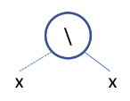
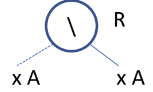
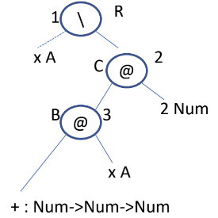
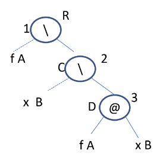
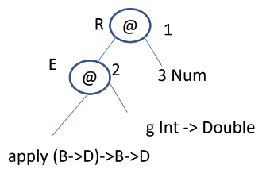
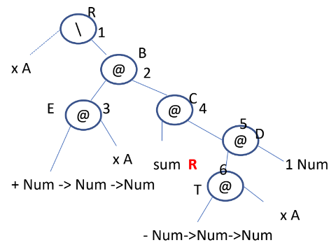
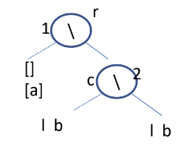
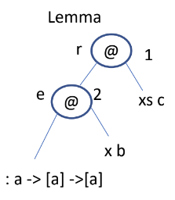
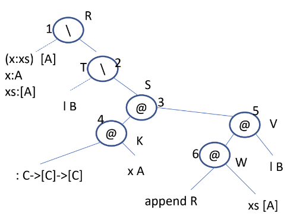

# Type inference in Haskell

Type inference is the process by which Haskell “guesses” the types for variables and functions, without you needing to specify these types explicitly. Many functional languages feature type inference.

## Examples

### Identity function

We start from the simplest function, the identity:

>  $id~x=x \iff id = \setminus x~\rightarrow~x$.

The basic representation is given by the following **tree**:



We associate a **type variable** to each node. When the same program variable appears more than once, then the same type variable is associated to all occurrences, as it happens with $x$ for $id$.



Corresponding to the root, we write a constraint that specifies that the type of the function $id$ (i.e. $R$) must be a function from the parameter type to the type of the body of the function. Thus we obtain: $R=A \rightarrow A$, which means $id :: A \rightarrow A$.

### Sum

Let’s consider a slightly more complicated example:

> $sum~x = x + 2 \iff sum = \setminus x \rightarrow x + 2$ 

The tree must now represent also the application of $+$ that we consider curried (hence with type $Num \rightarrow Num \rightarrow Num$).



The nodes $@$ **model function application**. There are two nodes $@$ for the application of $+$ to each parameter, since $+$ is curried (remember that its type is $Num \rightarrow Num \rightarrow Num$). **Each internal node produces a constraint**, the nodes are numbered to make this correspondence more clear:

1. $R = A \rightarrow C$
2. $B = Num \rightarrow C$
3. $Num \rightarrow Num \rightarrow Num = A \rightarrow B$  

Thus:

* Since $+$ is curried, its type is $Num \rightarrow (Num \rightarrow Num)$. Hence, from (3) we get $A=Num$ and $B = Num \rightarrow Num$
* If we substitute this value for $B$ in (2) we get:
  $Num \rightarrow Num = Num \rightarrow C$ , from which $C=Num$
* Then, substituting the values of $A$ and $C$ in (1) we obtain $R = Num \rightarrow Num$

### Higher order functions

Consider the function:

> $apply~f~x = f~x \iff apply = \setminus f \rightarrow \setminus x \rightarrow f~x$

Its typing is described by the following tree.



Then:

1. $R = A \rightarrow C$
2. $C = B \rightarrow D$
3. $A = B \rightarrow D$

Substituting (2) and (3) in (1) we obtain: $R = (B \rightarrow D) \rightarrow B \rightarrow D$. The parentheses derive from the fact that $A = B \rightarrow D$  is the argument type of the root. Thus the final type of $apply$ is $(B \rightarrow D) \rightarrow B \rightarrow D$. 

**Important note**: $(B \rightarrow D) \rightarrow B \rightarrow D \ne B \rightarrow D \rightarrow B \rightarrow D = B \rightarrow (D \rightarrow (B \rightarrow D))$, that is left association is different from right association. 

### Function call

Let’s consider the case of:

> $apply~g~3$ 

Note that $apply~g~3$ is not a function definition but a function call. Thus, $g$ must be defined before the call and of course it must have a type. Suppose $g :: Int \rightarrow Double$. Then the typing of the function call is described by the following tree.



Then:

1. $E = Num \rightarrow R$
2. $(B \rightarrow D) \rightarrow B \rightarrow D = (Int \rightarrow Double) \rightarrow E$

From (2) we get $Int \rightarrow Double = B \rightarrow D$ and $E = B \rightarrow D$, from which we deduce:

* $B = Int$

* $D = Double$

* $E = Int \rightarrow Double$

Thus, substituting in (1) we get $Int \rightarrow Double = Num \rightarrow R$. From this we derive $R = Double$ and the type of node 3 becomes $Int$ (in place of the more generic $Num$). Hence the type of the value delivered by $apply~g~3$ is $Double$.

### Recursive function

Consider the recursive function:

> $sum~x = x + (sum~(x - 1))$

It is described by the following tree.



Then:

1. $R = A \rightarrow B$
2. $E = C \rightarrow B$
3. $Num \rightarrow Num \rightarrow Num = A \rightarrow E$
4. $R = D \rightarrow C$
5. $T = Num \rightarrow D$
6. $Num \rightarrow Num \rightarrow Num = A \rightarrow T$

From (6) $A = Num$ and $T=Num \rightarrow Num$. Substituting this in (5) we get $D = Num$. Then from (3), we obtain $E = Num \rightarrow Num$ and from (2) $C = Num$ and $B = Num$. Finally substituting in (1) and (4) we get $R = Num \rightarrow Num$ in both cases.

### Function with multiple clauses

Consider the function defined as:

```haskell
append :: [a] -> [a] -> [a]
append []     l = l						-- case 1
append (x:xs) l = x : (append xs l)		-- case 2
```

For functions defined by cases, type inference must be done for each case separately and the inferred types are matched at the end. Notice that the definition uses pattern matching and thus we need to deal with the types of the patterns

#### Case 1

Consider the case: `append [] l = l`.



Then:

1. $r = [a] \rightarrow c$
2. $c = b \rightarrow b$

Thus, substituting (2) in (1) we get $r = [a] \rightarrow b \rightarrow b$.

#### Case 2

Consider the case: `append (x:xs) l = x : (append xs l)`. The pattern is $(x:xs)$ and
we need to compute its type and that of $x$ and $xs$ as well.



Then:

1. $e = c \rightarrow r$
2. $a \rightarrow [a] \rightarrow [a] = b \rightarrow e$

From (2), $b = a$ and $e = [a] \rightarrow [a]$. Substituting in (1), we get $c = [a]$ and $r = [a]$. Thus the whole pattern has type $[a]$, $x::a$ and $xs::[a]$.

Now we can consider the type inference of the case, as defined by the following tree.



Then:

1. $R = [A] \rightarrow T$
2. $T = B \rightarrow S$
3. $K = V \rightarrow S$
4. $C \rightarrow [C] \rightarrow [C] = A \rightarrow K$
5. $W = B \rightarrow V$
6. $R = [A] \rightarrow W$

From (4) we get $C = A$ and $K = [A] \rightarrow [A]$ and substituting $K$ in (3) we have $V = [A]$ and $S = [A]$. Then from (5) $W = B \rightarrow [A]$ and from (6) $R = [A] \rightarrow B \rightarrow [A]$. Now we need to continue to make sure that this type is compatible with (1). From (1) $[A] \rightarrow B \rightarrow [A] = [A] \rightarrow T$, hence $T = B \rightarrow [A]$. Substituting in (2) we get $B \rightarrow [A] = B \rightarrow [A]$ thus the typing is fine. Also (3) becomes $[A] \rightarrow [A] = [A] \rightarrow [A]$, as expected. Similarly, all constraints become trivially verified. Hence $R = [A] \rightarrow B \rightarrow [A]$.

#### Conclusion

If we match the types inferred in the two cases, that is:

$R = [A] \rightarrow B \rightarrow [A] = [a] \rightarrow b \rightarrow b = r$,

we get $a = A$ and $b = B = [A]$ thus the final type of append is: $[A] \rightarrow [A] \rightarrow [A]$.

## Exercises

### Ex 1

```haskell
data Tree a = Leaf a | Node a (Tree a) (Tree a)

k :: Tree (Tree a) -> (Tree a -> a) -> Tree a
k (Leaf x) 	   g = x							-- (1)
k (Node x y z) g = Node (g x) (k y g) (k z g)	-- (2)
```

------

#### Case 1

The type inference on case (1) produces the following tree:


Thus we have:

* $r = Tree~a \rightarrow t$
* $t = b \rightarrow a$

Then we deduce: $r = Tree~a \rightarrow b \rightarrow a$.

#### Case 2

The type inference on case (2) produces the following tree:


Thus we have:

* $B = A \rightarrow H$
* $D \rightarrow Tree~D \rightarrow Tree~D \rightarrow Tree~D = H \rightarrow O$
* $O = R \rightarrow M$
* $M = R \rightarrow L$
* $T = B \rightarrow L$
* $R = Tree~A \rightarrow T$

Then we deduce: 

* $D \rightarrow Tree~D \rightarrow Tree~D \rightarrow Tree~D = H \rightarrow R \rightarrow R \rightarrow L$
* $R = Tree~A \rightarrow (A \rightarrow D) \rightarrow Tree~D$

#### Conclusion

Putting together the two cases, we deduce what follows:

$R = Tree~A \rightarrow (A \rightarrow D) \rightarrow Tree~D = Tree~a \rightarrow b \rightarrow a = r$

Then:

* $a = Tree~D$
* $b = Tree~D \rightarrow D$

Therefore, the final type for $k$ is:  $R = Tree~Tree~D \rightarrow (Tree~D \rightarrow D) \rightarrow Tree~D$.

### Ex 2

```haskell
data Expr a = Var a | Val Int | Add (Expr a) (Expr a)

k (Var x)   g = Var (g x)
k (Val n)   g = Val n
k (Add x y) g = Add (k x g) (k y g)
```

------

#### Case 1

The type inference on case (1) produces the following tree:


Thus we have:

* $a \rightarrow Expr~a = c \rightarrow q$
* $r = q \rightarrow s$
* $s = d \rightarrow p$
* $b \rightarrow Expr~b = o \rightarrow p$
* $d = c \rightarrow o$

Then we deduce:

* $c = a$
* $q = Expr~a$
* $r = Expr~a \rightarrow s$
* $s = d \rightarrow p$
* $o = b$
* $p = Expr~b$
* $d = a \rightarrow b$

Therefore: $r = Expr~a \rightarrow (a \rightarrow b) \rightarrow Expr~b$.

#### Case 2

The type inference on case (2) produces the following tree:


Thus we have:

* $Int \rightarrow Expr~Int = e \rightarrow t$
* $s' = d' \rightarrow t'$
* $Int \rightarrow Expr~Int = e' \rightarrow t'$
* $r' = t \rightarrow s'$

Therefore: $r' = Expr~Int \rightarrow d' \rightarrow Expr~Int$.

#### Case 3

The type inference on case (3) produces the following tree:


Thus we have:

* $R = T \rightarrow S$
* $P = Y \rightarrow T $
* $Expr~A \rightarrow Expr~A \rightarrow Expr~A = X \rightarrow P$
* $S = D \rightarrow U$
* $W = R \rightarrow U$
* $Expr~B \rightarrow Expr~B \rightarrow Expr~B = R \rightarrow W$

Then we deduce:

* $Expr~A \rightarrow Expr~A \rightarrow Expr~A = X \rightarrow Y \rightarrow T$
* $X = Y = T = Expr~A$
* $Expr~B \rightarrow Expr~B \rightarrow Expr~B = R \rightarrow R \rightarrow U$
* $U = Expr~B$

Therefore: $R = Expr~A \rightarrow D \rightarrow Expr~B$.

#### Conclusion

Putting together the three cases we deduce what follows:

1. $r = Expr~a \rightarrow (a \rightarrow b) \rightarrow Expr~b =$
2. $= r' = Expr~Int \rightarrow d' \rightarrow Expr~Int =$
3. $= R = Expr~A \rightarrow D \rightarrow Expr~B$

Hence the final type of $k$ is $R = Expr~A \rightarrow (A \rightarrow B) \rightarrow Expr~B$.